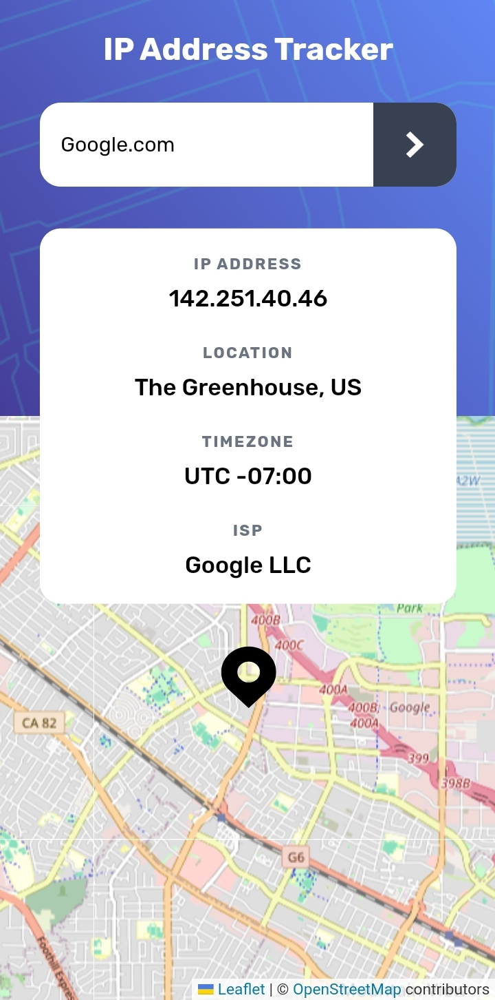

# Frontend Mentor - IP address tracker solution

This is a solution to the [IP address tracker challenge on Frontend Mentor](https://www.frontendmentor.io/challenges/ip-address-tracker-I8-0yYAH0). Frontend Mentor challenges help you improve your coding skills by building realistic projects. 

## Table of contents

- [Overview](#overview)
  - [The challenge](#the-challenge)
  - [Screenshot](#screenshot)
  - [Links](#links)
- [My process](#my-process)
  - [Built with](#built-with)
  - [What I learned](#what-i-learned)
  - [Continued development](#continued-development)
  - [Useful resources](#useful-resources)
- [Author](#author)
- [Acknowledgments](#acknowledgments)

## Overview

### The challenge

Users should be able to:

- View the optimal layout for each page depending on their device's screen size
- See hover states for all interactive elements on the page
- See their own IP address on the map on the initial page load
- Search for any IP addresses or domains and see the key information and location

### Screenshot

### Links

- Solution URL: [Add solution URL here](https://your-solution-url.com)
- Live Site URL: [https://iptracker.vercel.app](https://iptracker.vercel.app)

## My process

### Built with

- Semantic HTML5 markup
- CSS custom properties
- Flexbox
- Mobile-first workflow
- [Tailwind](https://tailwindcss.com/) - CSS framework
- [Geopify](https://geo.pify.org/) - Ip tracker api
- [Leaflet.js](https://leafletjs.com/) - JS library

### What I learned

This project introduce me to leaflet.js, a javascript library for displaying user location on a map. I learnt how to work with leaflet.js and also adding my own custom styling.

### Continued development

I want to take on javaecript projects that doesnt require the use of an api, because most of my projects are api based.

### Useful resources

- [Geopify documentation](https://geo.ipify.org/doc) - This helped me to know how to work with geopify api and its various endpoints.
- [LeafletJs documentation](https://leafletjs.com/reference.html) - This is an amazing doc which introduced me to leaflet.js and how to make use of it.

## Author

- Website - [Charmingdc](https://taplink.cc/charmingdc)
- Frontend Mentor - [@Charmingdc](https://www.frontendmentor.io/profile/Charmingdc)
- Twitter - [@Charmingdc01](https://www.twitter.com/Charmingdc01)

## Acknowledgments

I have to acknowledge Swag Azreal (Coderblip) for helping me out on changing the location on the map whenever a new ip address or domain is entered as a query.